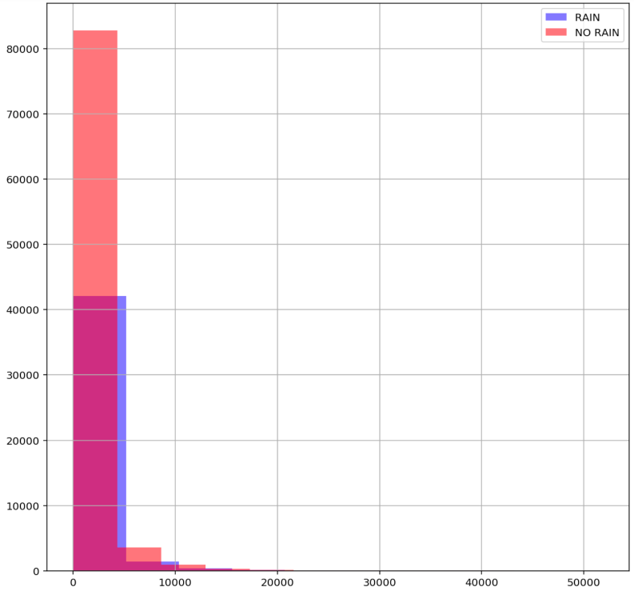
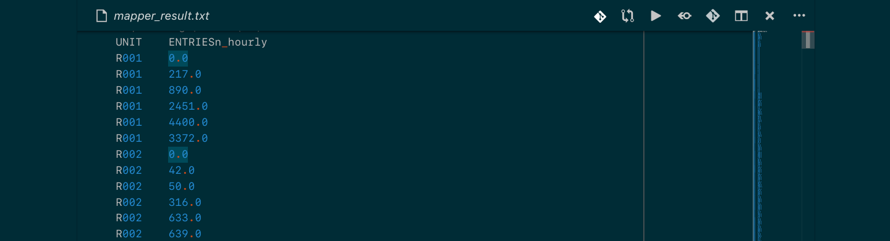
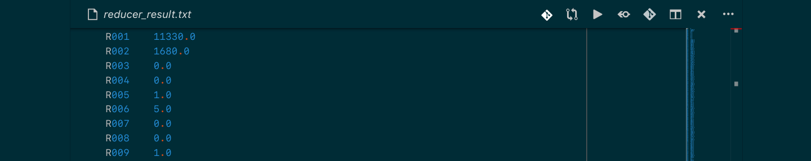

# Big Data Foundation Nanodegree

## Project: NYC Subway Data Analysis

## [Blog Version](https://medium.com/@sanjeevai/mapreduce-in-python-7bd272da09e6)

## Table of Contents

- [Introduction](#intro)
- [Problem Statement](#problem)
- [Part 1: Data Gathering](#p1)
- [Part 2: Data Analysis](#p2)
- [Part 3: MapReduce](#p2)
- [Files](#files)
- [Software Requirements](#sw_req)
- [Conclusion](#conclusion)
- [References](#refs)

***

<a id="intro"></a>

## Introduction

In this project, we look at NYC Subway Data to find out whether more people ride the subway when it’s raining versus when it’s not.

We will compare New York City Subway data, use statistical methods and data
visualization to draw an interesting conclusion about the subway with the
dataset that we have analysed.

The NYC public transportation system - **Metro Transit Authority** - provides data for download via csv files. Part of the information available are data from the subway turnstiles, containing **weekly logs for cumulative entries and exits** by turnstile and by subway station during a provided timeframe.

For this project, we only used the information available
[here](http://web.mta.info/developers/turnstile.html).

<a id="problem"></a>

## Problem Statement

The goal of this project is to explore the relationship between data from the **NYC Subway turnstiles** and the **city weather.** For this, besides data from the subway, we will also need data from the **weather in NYC.**

Here are the main points that will be considered in this work:

- **Gathering data** from the Internet
- **Using Statistics** for Data Analysis
- **Data handling** and **simple graphics creation** with `Pandas`

<a id="p1"></a>

## Part 1 - Data Gathering

The below code accesses the link http://web.mta.info/developers/turnstile.html
and downloads all files from **June 2017.** The files are named in this format:

*turnstile_100617.txt*, where 10/06/17 is the file's date.

The code below uses **urllib** library to open and redeem a webpage.

```python
u = urllib.urlopen(url)
html = u.read()
```

Now we'll use the **BeautifulSoup** library to search for the link to the file
we want to download in the page. The command below creates a *soup* object and
does a search for all 'a' tags in the document:

```python
soup = BeautifulSoup(html, "html.parser")
links = soup.find_all('a')
```

>A tip to only download the files from June is to check data in the name of the
>file. For instance, to download the 17/06/2017 file, we'll check if the link
>ends with *"turnstile_170610.txt"* like this:

```python
if '1706' in link.get('href'):
```

The final tip is to use the command below to download the txt file:

```python
urllib.urlretrieve(link_do_arquivo, filename)
```

After retrieving from URLs, these four TXT files are created:

1. turnstile_030617.txt
2. turnstile_100617.txt
3. turnstile_170617.txt
4. turnstile_240617.txt

Now we want to combine all the files into a single file to make the data
analysis process easier. Method `create_master_turnstile_file()` in Cell No. 5 in
Jupyter Notebook does that.

Next step is to filter the `DESCn` column to just consider the `REGULAR`
turnstiles. Method `filter_by_regular()` does that.

Now we have two functions which calculate the hourly entries and exits.

`get_hourly_entries()` calculates the hourly entries and `get_hourly_exits()`
calculates the hourly exits.

<a id="p2"></a>

## Part 2: Data Analysis

Distribution of hourly entries when calculated on the basis of raining condition
give some interesting results.

<a id="plot"></a>



This distribution is highly right-skewed for both the cases. Hourly entries are
significantly higher when it doesn't rain. It means more people use the subway
when the sky is clear.

<a id="p3"></a>

## Part 3: MapReduce

Now, we will create a mapper. For each entry line, the mapper exit will PRINT
(not return) `UNIT` as a key, and the number of `ENTRIESn_hourly` as the value.
We'll separate the key and the value with a tab. For example: 'R002 \ t105105.0'

```python
import sys

def mapper():
    """
    Parses "UNIT" and "ENTRIESn_hourly" for each row and prints to stdout
    """

    for line in sys.stdin:

        observation = line.strip().split(",")

        if len(observation) >= 7:
            unit = observation[1]
            entriesn_hourly = observation[6]

            print "%s\t%s" % (unit, entriesn_hourly)

sys.stdin = open('turnstile_data_master_with_weather.csv')
sys.stdout = open('mapper_result.txt', 'w')
mapper()
```

This creates *mapper_result.txt* with two entries per line. Here is a preview:



Now, we'll create the reducer. Given the mapper result from the previous exercise, the reducer will print (not return) one line per `UNIT`, with the total number of `ENTRIESn_hourly` during May (which is our data duration), separated by a tab. An example of exit line from the reducer will look like this: 'R001 \ t500625.0'

> Assumption:We assume that the entry for the reducer is ordered in a way that all lines corresponding to a particular unit are grouped. However, the reducer exit will have repetition, as there are stores that appear in different files' locations.

```python
def reducer():

    old_key = None
    entries_count = 0

    for line in sys.stdin:

        row = line.strip().split("\t")

        if len(row) != 2:
            continue

        this_key, this_entry = row
        try:
            if (old_key) and (old_key != this_key):
                print "%s\t%s" % (old_key, entries_count)
                old_key = this_key
                entries_count = 0
            old_key = this_key
            entries_count += float(this_entry)
        except:
            continue

sys.stdin = open('mapper_result.txt')
sys.stdout = open('reducer_result.txt', 'w')
reducer()
```

This create a `reducer_result.txt` file with only two entries: `UNIT` and total
number of entries through it. Here's a preview:



<a id="sw_req"></a>

## Software Requirements

This project uses Python 2.7.15 and the necessary libraries (except the standard
ones) are mentioned in _requirements.txt_ file.

<a id="files"></a>

## Files

<pre>
.
├── Analyzing_Subway_Data_NDFDSI.ipynb---------# ANALYSIS NOTEBOOK
├── mapper_result.txt--------------------------# MAPPER OUTPUT SAVED IN THIS FILE
├── master_file.txt----------------------------# COMBINATION OF THE BELOW FOUR TXT FILES
|                                              # OF TURNSTILE DATA
|                                              # (file format is turnstile_***.txt)
├── reducer_result.txt-------------------------# REDUCER OUTPUT SAVED IN THIS FILE
├── turnstile_030617.txt-----------------------# WEEK 1 TURNSTILE DATA FOR JUNE 2017
├── turnstile_100617.txt-----------------------# WEEK 2 TURNSTILE DATA FOR JUNE 2017
├── turnstile_170617.txt-----------------------# WEEK 3 TURNSTILE DATA FOR JUNE 2017
├── turnstile_240617.txt-----------------------# WEEK 4 TURNSTILE DATA FOR JUNE 2017
└── turnstile_data_master_with_weather.csv-----# WEATHER DATA DOWNLOADED FROM S3
</pre>

<a id="conclusion"></a>

## Conclusion

We compared the hourly trends for subway user when it rains vs when it doesn't.
From the graph [here](#plot), it looks like both distributions are skewed and on an
average people use subway more when the sky is clear.

Then we used Hadoop Streaming to perform a MapReduce job in Python. Mapper
function returns the number of hourly entries for every unit. And since the keys
are already sorted when parsing from `sys.stdin` to `mapper()`, there is **no
need to perform the intermediate shuffle sort step.** All we have to do is pass
the output of `mapper()` to `reducer()`. Reducer performs aggregated sum over
all keys. The result is a single value for every key (_unit_ in this case for
every
interaction count with subway users for each turnstile).

This project gives a practical experience of writing MapReduce jobs in Python
with the help of [Hadoop Streaming](https://archive.cloudera.com/cdh5/cdh/5/hadoop/hadoop-mapreduce-client/hadoop-mapreduce-client-core/HadoopStreaming.html#Hadoop_Streaming). Hadoop Streaming is a generic API which
allows writing Mappers and Reducers in **any language** which can read from
`stdin`.

<a id="refs"></a>

## References

- Data and metadata from [Metro Transit
  Authority](http://web.mta.info/developers/turnstile.html), New York.
